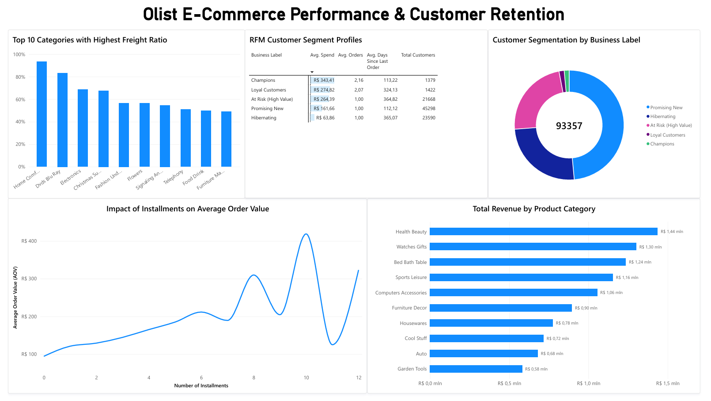

# Olist E-Commerce Analytics: End-to-End ELT Pipeline & RFM Segmentation

This project establishes a robust ELT (Extract, Load, Transform) data pipeline to analyze sales performance, logistics efficiency, and customer retention for the Brazilian Olist marketplace. It leverages SQL pushdown techniques to minimize local RAM usage and establishes a Single Source of Truth (SSOT) for seamless Business Intelligence integration.

## Tech Stack & Architecture
* **Database:** PostgreSQL (Analytical Views, Aggregations, DDL Transactions)
* **Data Processing:** Python, Pandas, SQLAlchemy (Statistical Modeling, Vectorized RFM Scoring)
* **Business Intelligence:** Power BI (Interactive Dashboards)
* **Architecture Pattern:** ELT. Heavy transformations (e.g., handling granularity mismatches, `COALESCE` for missing translations, safe division via `NULLIF`) are pushed down to PostgreSQL. Python is strictly reserved for complex statistical correlation and RFM boundary logic.

## Business Objectives
* Identify primary revenue drivers among product categories.
* Analyze logistics bottlenecks and calculate freight ratios per niche.
* Determine the statistical correlation between installment payment plans and Average Order Value (AOV).
* Segment the customer base using an RFM (Recency, Frequency, Monetary) model to evaluate overall retention.

## Executive Summary & Key Insights
* **Revenue Leaders:** The **Health Beauty** (>1.4M BRL) and **Watches Gifts** (~1.3M BRL) categories are the primary financial drivers. Five distinct product categories successfully exceed the 1M BRL gross revenue threshold, providing a stable commercial foundation.
* **Logistics Bottlenecks:** Freight costs disproportionately impact margins in specific physical niches. Categories such as **Home Comfort** and **Dvds Blu Ray** exhibit a staggering **80-90% freight ratio**, requiring immediate renegotiation of carrier weight limits.
* **Installments vs. AOV:** Statistical modeling proves a positive correlation between the installment payment system and shopping cart value. Splitting costs over extended periods (up to 12 months) directly stimulates customers to purchase premium items, significantly increasing the Average Order Value.
* **Retention Crisis (RFM):** Custom RFM segmentation reveals a critical loyalty deficit. Exactly **48.5% of the user base** falls into the *Promising New* segment (one-time buyers), while elite returning segments form a minimal fraction. This highlights an urgent need to shift marketing budgets from acquisition to targeted "win-back" campaigns.

## BI Dashboard

## How to Reproduce
1. **Database Setup:** Initialize a local PostgreSQL instance and load the raw Olist dataset.
2. **Environment:** Install the required Python dependencies:
   `pip install pandas sqlalchemy psycopg2-binary numpy`
3. **Execution:** Run the Jupyter Notebook cell by cell. The script will automatically connect to the database, generate the necessary analytical views, compute the RFM segments, and write the final SSOT tables back to PostgreSQL.
4. **Visualization:** Open the `.pbix` file in Power BI Desktop and refresh the data source to fetch the latest views from your local PostgreSQL server.